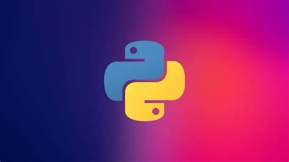
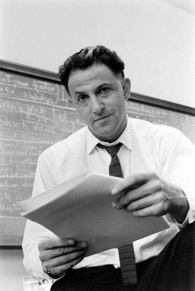
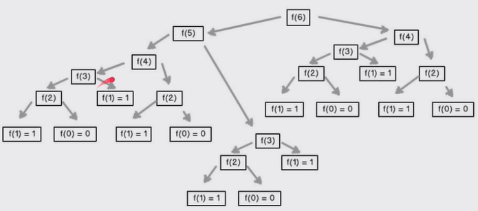

<div align="center">
  <h1>Programación Dinámica y Estocástica con Python</h1>
</div>

<div align="center"> 
  
</div>

# CONTENIDO
- [OBJETIVOS](#OBJETIVOS)
- [INTRODUCCIÓN](#INTRODUCCIÓN)
- [OPTIMIZACIÓN DE FUBONACCI](#OPTIMIZACIÓN DE FUBONACCI)

# OBJETIVOS
- Aprender cuándo utilizar la Programación Dinámia y en que nos puede beneficiar.
- Diferenciar entre progrmación determinista y estocástica.
- Aprender a utilizar la Programación Estocástica.
- Aprender a crear simulaciones computacionales.

# INTRODUCCIÓN

<div align="center"> 
  
  <p>Richard Bellman</p>
</div>

En los años 50s Richard Bellman para poder conseguir financiamiento gubernamental acuño el nombre de 
**Programación Dinámica**, la cual no tenia ninguna relación con las investigaciones en Matemáticas que llevaba acabo.

_'[Nombre] Programación Dinámica se escogió para esconder a patrocinadores gubernamentales el hecho que en realidad estaba haciendo Matemáticas. La frase Programación Dinámica es algo que ningún congresista'_ - Richard Bellman.

La Programación Dinámica es una tecnica poderosa que optimiza ciertos tipos de problemas, ahora bien los problemas que puede optimizar son aquellos que tienen la siguiente estructura:

- **Subestructura Óptima**. Crear una solucion global óptima al conbinar soluciones óptimas de subproblemas locales.

- **Problemas Empalmados**. Se crea una solución óptima para resolver un mismo problema varias veces(problemas que requieren ser repetidos una y otra vez).

Cuando se nos presenta un problema donde su ejecución requiere de resolver el mismo problema varias veces podemos solucionarlo con la **Memoization**(Memorización).

La Memorización(Memoization) evita computos adicionales guardando los resultados de dicho computo en una estructura de datos que podemos consultar posteiormente de una forma rapida.
<h2>
	Caracteristicas de la Memorización
</h2>

- Técnica para guardar compútos previos y evitar realizarlos nuevamente.
- Usamos por lo regular Diccionarios para almacenar los computos, donde las consultas se pueden hacer de una manera rapida.
- Sacrificamos espacio para optimizar el proceso de ejecución.

#OPTIMIZACIÓN DE FUBONACCI

Los Numeros de Fibonacci se representan por `Fn = Fn-1 + Fn-2` la cual es una serie recursiva, la serie de fubonacci es una serie exponencial, lo que implica que los calculos sean mas engorrosas entre mas grande sea el Fibonacci a calcular.

<div align="center">
  
  <p>Serie Fubonacci</p>
</div>

A continuación se muestra el codigo para calcular numeros de Fibonacci de manera recursiva.

```
def fibonacci_recursivo(n):
        if n == 0 or n == 1:
            return 1
        return fibonacci_recursivo(n-1) + fibonacci_recursivo(n-2)

def run():
    n = int(input('Escribe un numero: '))
    resultado = fibonacci_recursivo(n)
    print(resultado)

if __name__ == '__main__':
    run()
```
